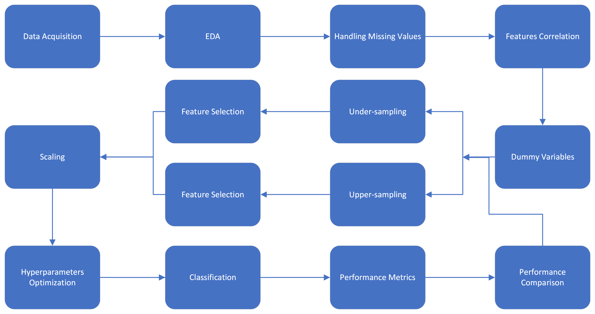

# Credit-and-Debit-Card-Fraud-Detection-Capstone-Project

- [Introduction](#introduction)
- [Data aquisition](#data)
- [Flow Chart](#flowchart)
- [Project Organization](#projectorg)

## Introduction  

**The Problem area**: Credit card fraud occurs when a customer uses a third party's credit card or information to make unauthorized purchases or cash advances. Credit card fraud happens both online and in physical stores. Merchants can avoid problems and bad reputations when they identify fraudulent use of credit cards in their payment environment. Credit card fraud detection is critical for companies to safeguard their customers' purchases and funds by detecting fraud before or as it occurs.

It's not always straightforward to agree on what fraud means. Regardless of how you define fraud, most payments are not fraudulent. Most merchants aren't experts at estimating the business impact of fraud.

Using Machine Learning for credit card fraud detection is an opportunity to create more efficient systems to avoid fraud. These systems will prevent fraud and avoid accusing legitimate purchases of fraud, too. This scenario will give the merchants more credibility, generating higher profits.

**The User**: Who experiences these problems? How would they benefit from the outcomes of your project?

Stakeholders, including issuers, banks, payment processors, and merchants, constantly seek ways to leverage multiple technological advancements to better align with their end-users preferences. In this context, they are always looking for ways to prevent fraud. As such, when a company commits fraud and incurs a significant loss, all stakeholders are directly or indirectly impacted. In some cases, employees may lose their jobs, consumers cannot access commodities, and surrounding communities may lose a significant source of tax revenue.

**The Big Idea**: How can machine learning bring solutions to these areas?

The problem of credit card fraud detection includes modeling past credit card transactions with knowledge of those that turned out to be fraud. A classification machine learning model can be used to identify whether a new transaction is fraudulent or not. The goal is to maximize the detection of fraudulent transactions while minimizing fraud misclassifications.

**The Impact**: What societal or business value do you anticipate your project to add? If possible, try to quantify the scale of the problem (in dollars, in CO2, in time spent, ...)

The FBI said it received 88,262 complaints overall from victims of fraud in the over-60 group last year. These sufferers reported $3.1 billion in losses, up almost $1 billion from 2021. The report found that the average dollar loss per victim totaled $35,101, with 5,456 victims losing more than $100,000.

In 2022, the Canadian Anti-Fraud Centre received fraud and cybercrime reports totaling $530$ million in victim losses—nearly a 40\% increase from the unprecedented $380$ million losses in 2021. Unfortunately, the increased reporting doesn't represent the actual financial loss, as the Canadian Anti-Fraud Centre estimates that only 5 to 10\% of people report fraud.

## Data Aquisition:  

**The Data**: Identify several possible datasets in this subject area and describe them at a high level. Include references. If you struggle to find more than one or two datasets, this might mean a Data Science approach to the problem will be challenging. Check in with your Educator.

The [Data](https://www.kaggle.com/competitions/ieee-fraud-detection/data) will be used in the Brainstation capstone project were found in the IEEE-CIS Fraud Detection Kaggle's competition. The competition is currently closed, so I don't have access to the submissions. The data is formed by 590,540 transactions divided in 569,877 genuine transaction and 20,663 fraudulent transactions. The transactions contains money transfer and also other gifting goods and service, like you booked a ticket for others, etc. The dataset also has 394 fields as following:

- TransactionDT: timedelta from a given reference datetime (not an actual timestamp). It first value is 86400, which corresponds to the number of seconds in a day (60 * 60 * 24 = 86400) so the unit is seconds. Using this, we know the data spans 6 months, as the maximum value is 15811131, which would correspond to day 183.
- TransactionAMT: transaction payment amount in USD.
- ProductCD: product code, the product for each transaction. Product isn't necessary to be a real 'product' (like one item to be added to the shopping cart). It could be any kind of service.
- card1 - card6: payment card information, such as card type, card category, issue bank, country, etc.
- addr: Address. Both addresses are for purchaser. addr1 as billing region and addr2 as billing country.
- dist: distances between (not limited) billing address, mailing address, zip code, IP address, phone area, etc.
- P\_ and (R\_\_) emaildomain: purchaser and recipient email domain. Certain transactions don't need recipient, so R\_ emaildomain is null.”
- C1-C14: counting, such as how many addresses are found to be associated with the payment card, etc. The actual meaning is masked. Counts of phone numbers, email addresses, names associated with the user, device, ipaddr, billingaddr, etc. Also these are for both purchaser and recipient, which doubles the number.
- D1-D15: timedelta, such as days between previous transaction, etc.
- M1-M9: match, such as names on card and address, etc.
- Vxxx: Vesta engineered rich features, including ranking, counting, and other entity relations. For example, how many times the payment card associated with a IP and email or address appeared in 24 hours time range, etc. All Vesta features were derived as numerical. Some of them are count of orders within a clustering, a time-period or condition, so the value is finite and has ordering (or ranking).

## Flow Chart  

## Project Organization   

The project is organized in three files:

- [Credit and Debit Card Fraud Detection EDA](Credit-Card-Fraud-Detection-EDA.ipynb)
- [Credit and Debit Card Fraud Detection Feature Engineering](Credit-Card-Fraud-Detection-Feature-Enginnering.ipynb)
- [Credit and Debit Card Fraud Detection Modeling](Credit-Card-Fraud-Detection-Modeling.ipynb)

These three files are responsible by the following:

1. Exploratory data analysis:

    Using Altair visualization package, the project exploratory data analysis (EDA) was employed to analyze and investigate the fraud data set and summarize its main characteristics. It will help to determine how best to manipulate data sources to get the necessary answers, making it possible to discover patterns, spot anomalies, or check assumptions. The EDA step was used to see what data can reveal beyond the formal modeling or hypothesis testing task and provide a better understanding of data set variables and their relationships. It will also assist in determining if the statistical techniques I have to consider for data analysis to be appropriate.
    The primary purpose of the following EDA is to help look at data before making any assumptions. It can help identify apparent errors, better understand patterns within the data, detect outliers or abnormal events, and find exciting relations among the variables. Once this EDA is complete and insights are drawn, its features can be used for ML classification modeling.

    Ten visualizations were designed during the exploratoty data analysis:

        - Total amount purchase per month;
        - Total count of transactions;
        - Product transaction distribution;
        - Products and services boxplot;
        - Cards brands distribution;
        - Cards Types distribution;
        - Cards brands distribution by transaction type;
        - Cards distribution by transaction type;
        - Average amount purchase;
        - Purchase distribution by email address;

2. Handling Missing Values:

    The dataset under analysis has 394 fields with relevant information about card transactions (purchases). Unfortunately, several fields are formed by thousands of missing values. The strategy chosen to deal with the missing values is to drop them. Fortunately, the remaining fields are far enough to continue the analysis and to perform data balance and ML classification.

3. Features correlation:

    A heatmap was designed to show the correlation among the most relevant independent variables. The highest correlation is between ProductCD and card6, but even in this case the correlation is low (-0.39). High positive correlation value is near 1.0 and high negative correlation value is near -1.0. The selected fields are not highly correlated.

4. Dummy Variables:

    There are four categorical fields in the analyzed dataset. Therefore, it is necessary to create dummy variables with them. Each field was converted into as many 0 and 1 variables as there are different values. The columns in the output were named according to the values in the original fields and prepended to the field's values. For now, It was considered just three fields. The P_emaildomain field will be included in a further version of the project.

5. Data balancing:

    The imbalanced datasets are a intrinsic characteristic of the problem of credit card fraud detection. One can see that the fraud dataset is highly imbalanced. The issue presents much more legitimate transactions than fraudulent transactions. It is not different in this case, so we must use a technique to balance the data. It was used under-sampling and upper-sampling techniques. After the under-sampling process, the remaining data has over 10 thousand legitimate and fraudulent transactions and after the upper-sampling method the amount of data is over than 420 thousand legitimate and fraudulent transactions.

6. Feature Selection:

    After to balance the data, one can perform feature selection. For this task, one chose the Recursive feature elimination with cross-validation to select features. This technique performs recursive feature elimination in a cross-validation loop to find the optimal number of features. Given an external estimator that assigns weights to features, recursive feature elimination aims to select features by recursively considering smaller and smaller sets of features. First, it trains the estimator on the initial set of features, and each feature's importance is obtained either through any specific attribute or callable. Then, it prunes the most minor essential features from the current features. That procedure is recursively repeated on the pruned set until it reaches the desired number of features.

7. Fraud Classification:

    This project section presents the models for advanced modeling. One can see the performance of five models: Decision Trees, Random Forests, Adaboost, Support Vector Machines, and Artificial Neural Networks. A feature selection is set for all models using a recursive feature elimination with cross-validation based on the Random Forests classifier. Next, a pipeline is designed with these steps: feature selection, feature scaling, model hyperparameters optimization, and training. To articulate a model evaluation, a performance metric report for each model is presented with accuracy, precision, recall, and f1-score.

    Models performance after under-sampling balance technique:

    - Decision Trees models:

        The Decision Trees performance was:

            Accuracy equals to 74%.
            Precision equals 72% for legitimate class and 77% for fraudulent class.
            R  ecall equals 78% for genuine class and 70% for fraudulent class.
            F1-score equals 75% for the genuine class and 73% for the fraudulent class.

    - Random Forests models:

            The Random Forests performance was:

            Accuracy equals to 72%.
            Precision equals 69% for the legitimate class and 76% for the fraudulent class.
            Recall equals 79% for genuine class and 65% for fraudulent class.
            F1-score equals 74% for the genuine class and 70% for the fraudulent class.

    - AdaBoost model:

            The Adaboost performance was:

            Accuracy equals to 78%.
            Precision equals 78% for the legitimate class and 78% for the fraudulent class.
            Recall equals 78% for genuine class and 79% for fraudulent class.
            F1-score equals 78% for the genuine class and 78% for the fraudulent class.

  - Suport Vector Machines models:

            The Support Vector Machines performance was:

            Accuracy equals to 72%.
            Precision equals 69% for the legitimate class and 77% for the fraudulent class.
            Recall equals 81% for genuine class and 64% for fraudulent class.
            F1-score equals 74% for the genuine class and 70% for the fraudulent class.

    - Artificial Neural Networks:

            The ANN performance was:

            Accuracy equals to 74%.
            Precision equals 71% for the legitimate class and 78% for the fraudulent class.
            Recall equals 80% for genuine class and 67% for fraudulent class.
            F1-score equals 75% for the genuine class and 72% for the fraudulent class.

    Models performance after upper-sampling balance technique:

    - Decision Trees models:

        The Decisioon Trees performance was:
            Accuracy equals to 86%.
            Precision equals 84% for the legitimate class and 88% for the fraudulent class.
            Recall equals 89% for genuine class and 83% for fraudulent class.
            F1-score equals 86% for the genuine class and 85% for the fraudulent class.

    - Random Forests models:

        The Random Forest performance was:

            Accuracy equals to 80%.
            Precision equals 77% for the legitimate class and 83% for the fraudulent class.
            Recall equals 84% for genuine class and 75% for fraudulent class.
            F1-score equals 81% for the genuine class and 79% for the fraudulent class.

    - AdaBoost model:

        The Adaboost performance was:

            Accuracy equals to 99%.
            Precision equals 98% for the legitimate class and 99% for the fraudulent class.
            Recall equals 99% for genuine class and 98% for fraudulent class.
            F1-score equals 99% for the genuine class and 98% for the fraudulent class.

    - Suport Vector Machines models:

        The Support Vector Machines performance was:

            Accuracy equals to xx%.
            Precision equals xx% for the legitimate class and xx% for the fraudulent class.
            Recall equals xx% for genuine class and xx% for fraudulent class.
            F1-score equals xx% for the genuine class and xx% for the fraudulent class.

    - Artificial Neural Networks models:

        The ANN performance was:

            Accuracy equals to 81%.
            Precision equals 78% for the legitimate class and 84% for the fraudulent class.
            Recall equals 85% for genuine class and 76% for fraudulent class.
            F1-score equals 82% for the genuine class and 80% for the fraudulent class.            

8. Conclusions:

    The data was investigated by checking for data unbalancing, visualizing the features, checking the null values, and understanding the relationship between different features. The data were split into train and test sets and scaled, and a feature selection technique based on feature importance was employed and evaluated for use in further pipelines. The hyperparameters were prepared for optimization, and a pipeline was created for each model with feature selection, scaling, hyperparameters tunning, and classification steps. The performance of Decision Trees, Random Forests, and Support Vector Machines are very similar. However, Adaboost ensemble machine learning models present the general best performance compared to all analyzed models. Another work that will be completed in the future is using neural nets to see if we could further improve the model results.
